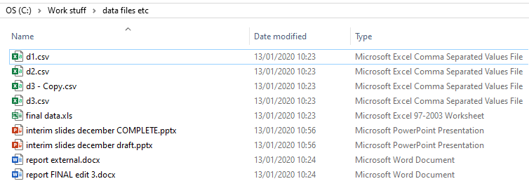

### The Principles of Good File-naming

- Common elements that a filename should include (where relevant) are: Version number, date of creation, name of creator, description of content, name of team/department, publication date and project number
- Naming policies should outlive the creator and be universal. Avoid generic names that might clash with other files, and consider scalability. For the version number, ensure it has enough digits for the future (e.g. v001 instead of v1)
- Always record changes to your data, even when small
- Don't use special characters (including #.<>$%!&*?”{}/:\@), use underscores instead of spaces, and format dates correctly
- A useful convention is to use ordinal numbers for major revisions and decimals for minor revisions (e.g. v001 to v002 for a major revision, and v001 to v001.1 for a minor revision)
- Be consistent between projects
- A good format for date designations is YYYYMMDD or YYMMDD. This format ensures that files stay in chronological order, even over the span of many years
- On occasion, data are autogenerated with base file names (e.g. f00001, f00002, ...). In this case, consider using a batch renaming tool
- Avoid words such as 'final', 'revision', etc, as they aren’t specific
- An example of a poor filename would be: **results final 7.xls**
- An example of a good filename would be: **ELISA_ID123_RH_170719_v002.xls**

Thinking about and typing a good filename may take an extra 30 seconds, but it may cost you a lot more time in the future if you don't.

### The Principles of Good Folder Organisation

- Use folders! Do not create a desktop of doom, with 200 random files littering your screen
- Use a sensible number of folders. Too few may mean too many files in a single folder. Too many may mean they're difficult to navigate
- Use sensible names. Don't worry about the level of detail for files, but do consider project names and the types of files in each folder, such as 'raw data', 'reports', 'code', etc
- Be consistent between projects
- Structure hierarchically. Start broad and drill-down into specific areas or projects
- Review folder content periodically, and consider moving older files that are no longer needed into an 'archive' folder

### Exercise - How could you improve the following set-up?

